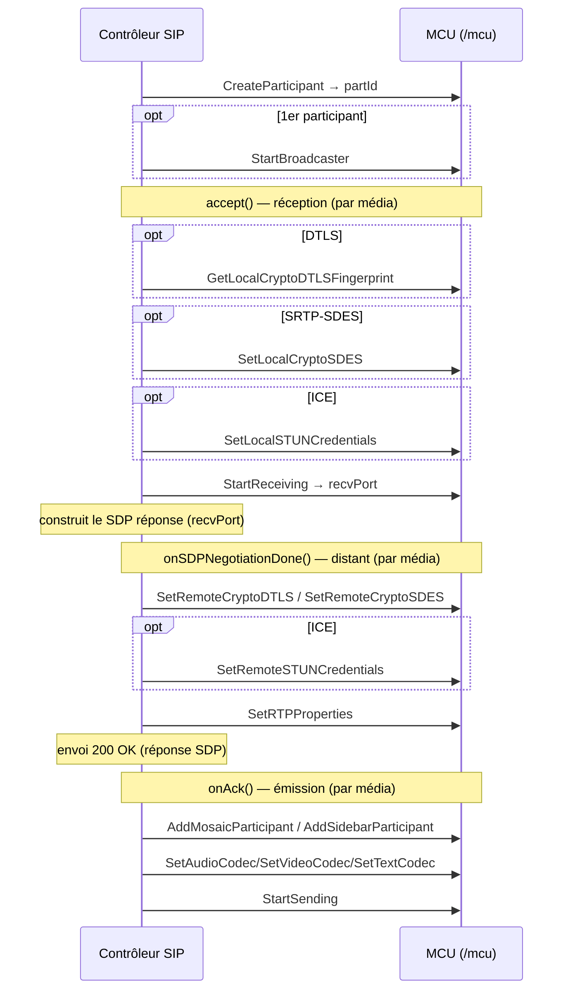

# API XML-RPC MCU du mediaserver

Documentation de l'API XML-RPC exposée par `mcu/src/xmlrpcmcu.cpp`
(table de commandes `mcuCmdList`, montée par `main.cpp` sur le gestionnaire
`MCU`).

Cette interface est l'API **spécialisée MCU** (multipoint control unit) : elle
pilote directement le moteur de conférence (`MCU` → `MultiConf` → participants /
mixers / mosaïques). Contrairement à l'[API JSR-309](JSR-309-API.md), plus
générique et orientée « endpoint / joinable », l'API MCU raisonne en termes de
**conférences** et de **participants** que l'on assemble dans des **mosaïques**,
**sidebars** et incrustations vidéo. C'est l'API historique du produit MCU.

> Toutes les chaînes de caractères (noms, tags, jetons) sont attendues et
> renvoyées en **UTF-8** (le serveur les repasse par un `UTF8Parser` →
> `std::wstring`).

---

## 1. Transport et points d'entrée HTTP

Le serveur HTTP interne écoute par défaut sur le port **8080**
(`--http-port`). Deux URL concernent l'API MCU :

| URL | Méthode | Rôle |
|-----|---------|------|
| `POST http://<host>:8080/mcu` | XML-RPC | Appels de commande (cette API) |
| `GET  http://<host>:8080/events/mcu/<queueId>` | HTTP *chunked* | Flux d'événements asynchrones (voir §5) |

Le média (RTP/SRTP, RTMP, WebSocket, BFCP) circule sur ses propres ports et
n'est pas décrit ici (voir le `readme.md` pour les options de ligne de commande).

> **Adresse annoncée dans le SDP.** L'adresse que le contrôleur doit mettre dans
> la ligne `c=` et dans les candidats ICE est celle que `StartReceiving` renvoie
> (§4, `returnVal[1]`) — jamais une adresse que le contrôleur déduirait de son
> côté. Elle dépend du **profil d'adressage** de la jambe (§6.7 bis) ; la même
> valeur alimente les candidats de `GetMediaCandidates` sur l'API JSR-309, donc
> les deux API annoncent forcément la même adresse.
>
> Le serveur **refuse de démarrer** si aucune adresse ne peut être déterminée :
> un serveur qui répond a donc toujours une adresse à annoncer, et le contrôleur
> n'a pas à prévoir de repli. Configuration côté serveur (NAT, réseau interne,
> ports à ouvrir) : `NETWORK-CONFIGURATION.md`.

Le `POST /mcu` est un XML-RPC standard :

- `Content-Type: text/xml`
- `Content-Length` obligatoire
- corps = `<methodCall>` XML-RPC classique

### Codes de type XML-RPC

Dans les signatures ci-dessous on note les types au format `xmlrpc-c` utilisé
par le serveur :

| Notation | Type XML-RPC | Sens |
|----------|--------------|------|
| `i` | `<int>` | entier 32 bits |
| `s` | `<string>` | chaîne UTF-8 |
| `b` | `<boolean>` | booléen |
| `S` | `<struct>` | structure (map clé→valeur) |
| `A` | `<array>` | tableau |

---

## 2. Format de réponse commun

**Toutes** les méthodes renvoient une structure XML-RPC avec la même enveloppe
(`xmlok()` / `xmlerror()` dans `mcu/src/xmlhandler.cpp`).

### Succès

```
{
  "returnCode": 1,          // int, toujours 1 en cas de succès
  "returnVal":  [ ... ]     // array, contenu dépendant de la méthode
}
```

- Pour les commandes « void » (delete, start, stop, set…), `returnVal` est un
  **tableau vide** `[]`.
- Pour les commandes de création / requête, `returnVal` contient les valeurs de
  retour (id créé, port, statistiques…) — détaillé méthode par méthode.

### Erreur

```
{
  "returnCode": 0,          // int, 0 = échec
  "errorMsg":   "..."       // string, message d'erreur (anglais)
}
```

> ⚠️ Piège d'implémentation : le serveur distingue le succès de l'erreur par le
> champ **`returnCode`**, et non par une *fault* XML-RPC. Une réponse HTTP 200
> avec `returnCode: 0` est un échec applicatif. Une vraie *fault* XML-RPC
> (HTTP 500) n'arrive qu'en cas d'erreur de parsing des paramètres.
>
> ⚠️ Quelques handlers de sécurité (`SetLocalCryptoSDES`, `SetRemoteCryptoSDES`,
> `SetRemoteCryptoDTLS`, `SetLocalSTUNCredentials`, `SetRemoteSTUNCredentials`,
> `SetRTPProperties`, `GetLocalCryptoDTLSFingerprint`) renvoient un **`0` brut**
> (et non l'enveloppe `xmlerror`) en cas d'échec de parsing des arguments.

---

## 3. Modèle objet et conventions

L'API est **orientée conférence**. La hiérarchie des objets et leurs
identifiants entiers :

```
MCU
 └─ Conference (confId)              ← CreateConference
     ├─ Participant (partId)         ← CreateParticipant   (type RTP ou RTMP)
     ├─ Mosaic (mosaicId)            ← CreateMosaic        (composition vidéo)
     ├─ Sidebar (sidebarId)          ← CreateSidebar       (sous-mélange dédié)
     ├─ Player (playerId)            ← CreatePlayer        (lecture de fichier)
     ├─ Broadcaster                  ← StartBroadcaster    (diffusion RTMP/FLV)
     └─ EventQueue (queueId)         ← EventQueueCreate    (file d'événements)
```

### Conventions d'appel

- Presque toutes les commandes prennent le `confId` en **premier paramètre** ;
  l'objet ciblé (participant, mosaïque, sidebar, player) est désigné par son id
  dans les paramètres suivants.
- Les identifiants sont des **entiers** attribués par le serveur à la création
  et valables pour la durée de vie de la conférence.
- Beaucoup de commandes média/sécurité acceptent un paramètre `role`
  (`MediaFrame::MediaRole`, §4) qui distingue le flux vidéo **principal** du
  flux **présentation/slides**. Ce paramètre a été ajouté après coup : les
  handlers tentent d'abord la signature **avec** `role`, puis retombent sur
  l'ancienne signature **sans** `role` (valeur par défaut `VIDEO_MAIN` = 0). Les
  deux formes sont donc acceptées.
- De même, `StartReceiving` accepte un paramètre `proto`
  (`MediaFrame::MediaProtocol`, §4) ajouté après coup (défaut `TCP` = 3).

### Cycle de vie type d'une conférence

```
EventQueueCreate                       → queueId
CreateConference(tag, vad, rate, queueId)  → confId
CreateMosaic(confId, comp, size)       → mosaicId
CreateParticipant(confId, name, type, mosaicId, sidebarId) → partId
SetAudioCodec / SetVideoCodec / SetTextCodec …
StartReceiving(confId, partId, media, rtpMap, role, proto, offer, profile)
                                                    → recvPort, ip, fmtpByPt
StartSending(confId, partId, media, ip, port, rtpMap, role, profile)
AddMosaicParticipant(confId, mosaicId, partId)
…                                      (conférence active)
DeleteParticipant(confId, partId)
DeleteConference(confId)
EventQueueDelete(queueId)
```

---

## 4. Énumérations

Valeurs entières à passer telles quelles dans les paramètres `i`.

### `MediaFrame::Type` — type de média
(`libmedikit/medkit/media.h`)

| Valeur | Nom |
|--------|-----|
| 0 | Audio |
| 1 | Video |
| 2 | Text |
| 3 | Application |

### `MediaFrame::MediaProtocol` — protocole de transport
| Valeur | Nom |
|--------|-----|
| 0 | RTP |
| 1 | RTMP |
| 2 | WS (WebSocket) |
| 3 | TCP (MSRP, BFCP…) |
| 4 | UDP |

### `MediaFrame::MediaRole` — rôle du flux vidéo
| Valeur | Nom |
|--------|-----|
| 0 | VIDEO_MAIN (défaut) |
| 1 | VIDEO_SLIDES |

### `Participant::Type` — type de transport participant
(`mcu/include/participant.h`)

| Valeur | Nom | Transport |
|--------|-----|-----------|
| 0 | RTP | RTP/SRTP (SIP, WebRTC) |
| 1 | RTMP | RTMP (Flash / web) |

### `AudioCodec::Type`
(`libmedikit/medkit/codecs.h`)

| Valeur | Nom |
|--------|-----|
| 0 | PCMU |
| 3 | GSM |
| 8 | PCMA |
| 9 | G722 |
| 97 | AAC |
| 98 | OPUS |
| 99 | SLIN |
| 100 | TELEPHONE_EVENT |
| 117 | SPEEX16 |
| 118 | AMR |
| 119 | G7221 |
| 120 | AMRWB |
| 130 | NELLY8 |
| 131 | NELLY11 |

### `VideoCodec::Type`
| Valeur | Nom |
|--------|-----|
| 34 | H263_1996 |
| 99 | H264 |
| 100 | SORENSON |
| 103 | H263_1998 |
| 104 | MPEG4 |
| 106 | VP6 |
| 107 | VP8 |
| 108 | ULPFEC |
| 109 | RED |
| 110 | AV1 |

### `TextCodec::Type`
| Valeur | Nom |
|--------|-----|
| 105 | T140RED |
| 106 | T140 |

### `AppCodec::Type`
| Valeur | Nom |
|--------|-----|
| 150 | BFCP |

### `Mosaic::Type` — type de composition vidéo
(`mcu/include/mosaic.h`)

| Valeur | Nom | Disposition |
|--------|-----|-------------|
| 0 | mosaic1x1 | plein écran |
| 1 | mosaic2x2 | 2×2 |
| 2 | mosaic3x3 | 3×3 |
| 3 | mosaic3p4 | 3+4 |
| 4 | mosaic1p7 | 1 grand + 7 |
| 5 | mosaic1p5 | 1 grand + 5 |
| 6 | mosaic1p1 | 1+1 |
| 7 | mosaicPIP1 | incrustation 1 |
| 8 | mosaicPIP3 | incrustation 3 |
| 9 | mosaic4x4 | 4×4 |
| 10 | mosaic1p4 | 1 grand + 4 |
| 11 | mosaic2p8 | 2+8 |

> Le paramètre `size` (mosaïques et `SetVideoCodec`) est un **code de
> taille/résolution** (index d'un tableau de résolutions prédéfinies), pas une
> largeur en pixels. Voir la table ci-dessous.

### Codes de résolution — paramètre `size` / `mode`
(valeurs telles qu'utilisées par le client `XmlRpcMcuClient` et le contrôleur SIP)

| Valeur | Nom | Résolution | Valeur | Nom | Résolution |
|--------|-----|------------|--------|-----|------------|
| 0 | QCIF | 176 × 144 | 9 | sd448P | 576 × 448 |
| 1 | CIF | 352 × 288 | 10 | w288P | 512 × 288 |
| 2 | VGA | 640 × 480 | 11 | w576 | 1024 × 576 |
| 3 | PAL | 768 × 576 | 12 | FOURCIF | 704 × 576 |
| 4 | HVGA | 480 × 320 | 13 | FOURSIF | 704 × 576 |
| 5 | QVGA | 320 × 240 | 14 | XGA | 1024 × 768 |
| 6 | HD720P | 1280 × 720 | 15 | WVGA | 800 × 480 |
| 7 | WQVGA | 400 × 240 | 16 | DCIF | 528 × 384 |
| 8 | w448P | 768 × 448 | 17 | w144P | 256 × 144 |

### Valeurs spéciales de slot de mosaïque
(`mcu/include/mosaic.h`, paramètre `id` de `SetMosaicSlot`)

| Valeur | Nom | Sens |
|--------|-----|------|
| > 0 | *(partId)* | affecte ce participant au slot |
| 0 | SlotFree | slot libre |
| -1 | SlotLocked | slot verrouillé (aucun participant) |
| -2 | SlotVAD | slot piloté par la détection d'activité vocale |
| -3 | SlotReset | réinitialise le slot |

### Modes VAD — paramètre `vad` de `CreateConference`/`UpdateConference`
(`VideoMixer::VADMode`, `mcu/include/videomixer.h`)

| Valeur | Nom | Comportement |
|--------|-----|--------------|
| 0 | NoVAD | détection d'activité vocale désactivée |
| 1 | BasicVAD | le locuteur actif est affiché dans le slot `SlotVAD`, remplacé immédiatement (sans hystérésis) ; le slot se vide dans le silence ; les autres slots ne bougent pas |
| 2 | FullVAD | comme BasicVAD, plus : hystérésis (le locuteur élu garde le slot ~5 s, `vadDefaultChangePeriod`), le dernier locuteur reste affiché dans le silence, et la mosaïque est réorganisée quand le locuteur élu occupait déjà un autre slot |

---

## 5. Événements asynchrones (file d'événements)

Le serveur ne rappelle pas le client : celui-ci **récupère** les événements par
un GET HTTP long-poll / *chunked*.

### Mise en place

1. `EventQueueCreate` → `queueId`.
2. Passer ce `queueId` à `CreateConference` : les événements de la conférence y
   seront routés.
3. Ouvrir en parallèle `GET http://<host>:8080/events/mcu/<queueId>`.

### Flux d'événements

La réponse est en `Transfer-Encoding: chunked`, `Content-Type: text/xml`. Le
serveur maintient la connexion ouverte et :

- envoie, pour chaque événement, une **réponse XML-RPC sérialisée**
  (`<methodResponse>` contenant le tuple de l'événement) ;
- envoie un **keep-alive** s'il n'y a pas d'événement dans le délai ;
- ferme le flux quand la file est détruite (`EventQueueDelete`).

Chaque événement est un tuple dont le **premier entier est le type d'événement**
(`MCU::Events`).

### Le long-poll est la preuve de vie du contrôleur (expiration automatique)

⚠️ **Contrat** : le serveur considère le long-poll comme le *heartbeat* du
contrôleur. **Deux signaux** conduisent à la destruction des conférences, avec
le même délai de grâce de **60 s** (défaut, cf. `--event-queue-expires`) :

1. **file toujours là, mais plus lue** pendant 60 s → le contrôleur est mort
   sans prévenir. Le serveur détruit **toutes les conférences créées avec ce
   `queueId`** (participants, mixers, mosaïques, broadcaster et ports RTP
   compris), libère leurs `tag`, puis détruit la file.
2. **file détruite (`EventQueueDelete`) alors que des conférences la référencent
   encore** → **pas de destruction immédiate** : le serveur *arme* le délai de
   grâce et ne détruit ces conférences qu'à son échéance, pour laisser au
   contrôleur une chance de se reconnecter.

**La portée du nettoyage est celle que le contrôleur choisit** en découpant ses
files : le `queueId` est porté par la **conférence** (`CreateConference`), donc

- **une file par conférence** → les conférences sont isolées : perdre le
  long-poll d'une file ne détruit que cette conférence. C'est le découpage
  recommandé ;
- **une file partagée** par plusieurs conférences (le montage décrit au §7.2)
  → 60 s sans lecteur les emportent **toutes ensemble**. C'est cohérent avec le
  fait que le contrôleur est alors globalement mort, mais il faut en avoir
  conscience : dans les versions antérieures, une conférence orpheline survivait
  jusqu'au redémarrage du serveur.

Autres conséquences :

- **ouvrir le long-poll sans tarder** après `EventQueueCreate` : le délai court
  dès la création de la file, et une file jamais lue est détruite au bout du
  même délai ;
- **`queueId` doit désigner une file réelle** : une conférence créée avec un
  `queueId` > 0 fantaisiste est détruite au bout du délai de grâce, comme si sa
  file avait été supprimée. Seul `queueId` ≤ 0 (« pas de file », ce que produit
  le transport MOTELI quand `eventListenerId` est absent) met une conférence
  hors d'atteinte du nettoyage — comme il la privait déjà de ses événements ;
- aucun événement n'annonce l'expiration (il n'y aurait plus de lecteur) : la
  trace est côté serveur (`/var/log/mcu.log`, `MCU: suppression de la conference
  … : controleur absent du long-poll`) ;
- `--event-queue-expires 0` désarme entièrement le mécanisme (comportement
  historique, `EventQueueDelete` sans effet de bord).

La même politique gouverne les `MediaSession` de l'API `/jsr309`
(`JSR-309-API.md` §5) — c'est le même code de balayage.

### Types d'événements

Source unique : `mcu/include/mcu.h` (`MCU::Events`).

| Type | Nom | Tuple |
|------|-----|-------|
| 1 | ParticipantRequestFPU | `(int type, int confId, string tag, int partId)` |
| 2 | ParticipantRequestDocSharing | `(int type, int confId, string tag, int partId, string status)` |
| 3 | ParticipantMediaTimeout | `(int type, int confId, string tag, int partId, int media, int role)` |
| 4 | ParticipantMediaConnected | `(int type, int confId, string tag, int partId, int media, int role)` |

> Les codes sont **ajoutés en fin**, jamais renumérotés ni réutilisés : ils sont
> partagés avec tous les contrôleurs, y compris ceux qui ne connaissent que 1 et 2
> (un type inconnu doit être ignoré, pas traité comme une erreur).

- **ParticipantRequestFPU** (1) : un participant a demandé une image complète
  (Full Picture Update / keyframe). `tag` = nom/tag de la conférence, `partId` =
  participant demandeur. Émis par `onParticipantRequestFPU`.
- **ParticipantRequestDocSharing** (2) : un participant demande à (dé)partager
  un document (BFCP). `status` ∈ `{ACTIVE, WAITING_ACCEPT, NONE, FAILED}`. À
  traiter avec `AcceptDocSharingRequest` / `RefuseDocSharingRequest` /
  `StopDocSharing` (§6.10). Émis par `onParticipantRequestDocSharing`.

- **ParticipantMediaTimeout** (3) : le flux RTP d'un média de ce participant s'est
  **tu**. Émis **une seule fois** par transition actif → inactif, sur le média et le
  rôle concernés (`media` = `MediaFrame::Type` §4, `role` = `MediaFrame::MediaRole`) —
  un participant portant audio + vidéo principale + présentation, il faut les deux
  pour savoir quelle ligne `m=` s'est arrêtée. N'est émis que si le contrôleur a armé
  le chien de garde (`StartRTPTimeout`, §6.7) : **rien n'est surveillé par défaut**.
  Émis par `onParticipantMediaTimeout`.
- **ParticipantMediaConnected** (4) : **premier paquet RTP/SRTP validé** d'un cycle de
  réception, même tuple. Émis une fois **par cycle** : un `StopReceiving` suivi d'un
  `StartReceiving` le réarme. Pour une patte sécurisée, le recevoir prouve
  intrinsèquement que la poignée de main DTLS a abouti — c'est l'équivalent conférence
  de l'`EndpointConnectedEvent` de JSR-309. Émis par `onParticipantMediaConnected`.

Réf. : `mcu/include/mcu.h` (`PlayerRequestFPUEvent`,
`PlayerRequestDocSharingEvent`, `ParticipantMediaEvent`), `mcu/src/mcu.cpp`.

---

## 6. Référence des méthodes

Chaque méthode est décrite par sa (ses) signature(s) de paramètres et sa valeur
de retour. Quand plusieurs signatures sont listées, le serveur essaie la
première puis retombe sur les suivantes (compatibilité ascendante).

### 6.1 Files d'événements

#### `EventQueueCreate`
Crée une file d'événements.
- **Params** : aucun.
- **Retour** : `(i)` = `queueId`.

#### `EventQueueDelete`
Détruit une file d'événements (ferme le flux HTTP associé).
- **Params** `(i)` : `queueId`.
- **Retour** : vide.

> Les conférences créées avec ce `queueId` **ne sont pas détruites sur le coup**
> mais entrent dans un délai de grâce de 60 s, à l'issue duquel elles sont
> supprimées si le contrôleur n'est pas revenu (§5).

---

### 6.2 Conférences

#### `CreateConference`
Crée et initialise une conférence.
- **Params** `(siii)` : `tag` (nom UTF-8), `vad` (mode VAD, 0..2, §4), `rate`
  (fréquence d'échantillonnage audio en Hz, défaut 16000), `queueId` (file
  d'événements).
- **Params** (ancienne API) `(sii)` : `tag`, `vad`, `queueId` ; `rate` = 16000.
- **Retour** : `(i)` = `confId`.

#### `UpdateConference`
Met à jour le mode VAD d'une conférence.
- **Params** `(iii)` : `confId`, `vad` (mode VAD, §4, appliqué seulement si dans
  [0,2]), `rate` (accepté mais ignoré).
- **Retour** : vide.

#### `DeleteConference`
Détruit une conférence et libère ses ressources.
- **Params** `(i)` : `confId`.
- **Retour** : vide.

#### `GetConferences`
Liste les conférences actives.
- **Params** : aucun.
- **Retour** : tableau de `(isi)` par conférence : `id`, `name`, `numPart`
  (nombre de participants).

#### `AddConferenceToken`
Ajoute un jeton (PIN) de diffusion autorisé pour la conférence.
- **Params** `(is)` : `confId`, `token` (UTF-8).
- **Retour** : vide.

---

### 6.3 Mosaïques

#### `CreateMosaic`
Crée une mosaïque (composition vidéo) dans la conférence.
- **Params** `(iii)` : `confId`, `comp` (`Mosaic::Type`, §4), `size` (code de
  résolution, §4).
- **Retour** : `(i)` = `mosaicId`.

#### `SetCompositionType`
Change le type de composition et la taille d'une mosaïque existante.
- **Params** `(iiii)` : `confId`, `mosaicId`, `comp` (`Mosaic::Type`), `size`.
- **Retour** : vide.

#### `SetMosaicSlot`
Affecte un participant (ou une valeur spéciale) à un slot de la mosaïque.
- **Params** `(iiii)` : `confId`, `mosaicId`, `num` (numéro de slot/position),
  `id` (partId ou valeur spéciale : SlotFree/SlotLocked/SlotVAD/SlotReset, §4).
- **Retour** : vide.

#### `SetMosaicOverlayImage`
Applique une image d'incrustation (overlay) sur la mosaïque.
- **Params** `(iis)` : `confId`, `mosaicId`, `filename` (chemin de l'image).
- **Retour** : `(i)` = `mosaicId`.

#### `ResetMosaicOverlay`
Retire l'incrustation de la mosaïque.
- **Params** `(ii)` : `confId`, `mosaicId`.
- **Retour** : `(i)` = `mosaicId`.

#### `DeleteMosaic`
Détruit une mosaïque.
- **Params** `(ii)` : `confId`, `mosaicId`.
- **Retour** : `(i)` = `mosaicId`.

#### `AddMosaicParticipant`
Ajoute un participant à la mosaïque (son flux devient éligible à l'affichage).
- **Params** `(iii)` : `confId`, `mosaicId`, `partId`.
- **Retour** : vide.

#### `RemoveMosaicParticipant`
Retire un participant de la mosaïque.
- **Params** `(iii)` : `confId`, `mosaicId`, `partId`.
- **Retour** : vide.

#### `GetMosaicPositions`
Renvoie l'occupation des positions de la mosaïque.
- **Params** `(ii)` : `confId`, `mosaicId`.
- **Retour** : tableau de `i` = liste des participants (ou valeurs de slot) par
  position, dans l'ordre.

---

### 6.4 Sidebars

Un *sidebar* est un sous-mélange audio/vidéo dédié (par ex. pour un aparté ou un
groupe de participants).

#### `CreateSidebar`
- **Params** `(i)` : `confId`.
- **Retour** : `(i)` = `sidebarId`.

#### `DeleteSidebar`
- **Params** `(ii)` : `confId`, `sidebarId`.
- **Retour** : `(i)` = `sidebarId`.

#### `AddSidebarParticipant`
- **Params** `(iii)` : `confId`, `sidebarId`, `partId`.
- **Retour** : vide.

#### `RemoveSidebarParticipant`
- **Params** `(iii)` : `confId`, `sidebarId`, `partId`.
- **Retour** : vide.

---

### 6.5 Participants — cycle de vie et affectation

#### `CreateParticipant`
Crée un participant et l'affecte à une mosaïque et un sidebar.
- **Params** `(isiii)` : `confId`, `name` (UTF-8), `type` (`Participant::Type` :
  RTP=0 / RTMP=1), `mosaicId`, `sidebarId`.
- `name` n'est pas qu'une trace : c'est l'**étiquette de départ du mixeur
  texte**, celle que le flux mixé écrit entre crochets devant chaque tour de
  parole (`[alice] bonjour`). `SetParticipantDisplayName` la remplace ensuite.
- **Retour** : `(i)` = `partId`.

#### `DeleteParticipant`
- **Params** `(ii)` : `confId`, `partId`.
- **Retour** : vide.

#### `SetParticipantMosaic`
Change la mosaïque *de sortie* (celle que reçoit) du participant.
- **Params** `(iii)` : `confId`, `partId`, `mosaicId`.
- **Retour** : vide.

#### `SetParticipantSidebar`
Change le sidebar de sortie du participant.
- **Params** `(iii)` : `confId`, `partId`, `sidebarId`.
- **Retour** : vide.

#### `SetParticipantDisplayName`
Pose (ou efface) le nom affiché d'un participant. Ce nom sert à **deux
rendus** : le bandeau en surimpression sur sa vignette vidéo, et l'étiquette
que le mixeur texte écrit devant chaque tour de parole.
Le bandeau vidéo est **par participant et par mosaïque** — il n'y a pas de
« nom global de conférence » ; l'incrustation pleine toile, elle, est une image
(`SetMosaicOverlayImage`).
- **Params** `(iiisi)` : `confId`, `mosaicId`, `partId`, `name` (UTF-8 ;
  chaîne vide = efface le bandeau), `scriptCode`.
- ⚠️ **Ordre réel : `mosaicId` AVANT `partId`** (comme
  `SetParticipantBackground`) — les noms de variables du handler suggèrent
  l'inverse et une version antérieure de cette doc le reflétait à tort.
  `mosaicId = -1` = toutes les mosaïques **existantes** de la conférence
  (valeur recommandée pour l'usage courant).
- `scriptCode` (ISO 15924) : `0` = auto-détection d'après les caractères du
  nom ; sinon `215` latin (fonte helvetica), `410` hiragana / `411` katakana
  (SazanamiMincho), `500` han (ZenKaiUni). Arabe (160) et cyrillique (220)
  **non supportés** : erreur, aucun bandeau. Les fontes citées doivent être
  connues d'ImageMagick sur le serveur, sinon le rendu échoue (trace dans
  `mcu.log`, pas de bandeau).
- **Rendu** : bandeau arrondi gris semi-transparent + texte blanc, en bas du
  slot du participant (liseré noir exclu) ; texte tronqué avec « ... » s'il
  dépasse la largeur du slot. Un changement de nom à taille de slot constante
  ne reconstruit pas le graphe de composition (recomposition seule).
- **Conditions** : le participant doit exister **et** appartenir à la mosaïque
  visée, sinon erreur « no such participant ». À appeler après la création du
  participant ; à **ré-émettre après un `CreateMosaic`** ultérieur (une
  mosaïque neuve ne connaît pas les bandeaux existants), alors qu'un
  `SetCompositionType` les conserve (les overlays suivent les participants).
- **Étiquette texte** : le même nom remplace l'étiquette du mixeur texte, celle
  que `CreateParticipant` avait posée. Elle ne connaît ni mosaïque ni
  `scriptCode` : un participant a **un** nom affiché, pas un par média. Elle est
  tronquée à **20 caractères** (des caractères, pas des octets : un idéogramme
  compte pour un). Une chaîne vide efface le bandeau vidéo **et** rend
  l'étiquette au `name` de `CreateParticipant`. Un participant qui rejoint plus
  tard voit le nom courant, pas celui de la création.
- **Retour** : `(i)` = 1. C'est le verdict de la **partie vidéo** seule :
  l'étiquette texte est posée dans tous les cas.
- Séquence type côté contrôleur, à l'arrivée de chaque participant :
  `SetParticipantDisplayName(confId, -1, partId, "Alice", 0)`.

#### `SetParticipantBackground` / `SetParticipantOrMosaicImage`
*(même handler)* Définit l'image de fond d'un participant, ou une image
d'incrustation sur une mosaïque.
- **Params** `(iiisi)` : `confId`, `mosaicId`, `partId`, `filename` (chemin de
  l'image), `imageRole`.
  - `imageRole = 0` (fond) → applique l'image de fond du participant.
  - `imageRole = 1` (overlay) → applique une incrustation sur la mosaïque.
- **Params** (ancienne API) `(iis)` : `confId`, `partId`, `filename` ;
  `mosaicId` = -1, `imageRole` = 0 (fond).
- **Retour** : `(i)` = code de résultat.
- ⚠️ Dans la forme complète, l'ordre est **`mosaicId` avant `partId`**.

#### `AddParticipantInputToken`
Ajoute un jeton (PIN) d'entrée autorisé pour le participant.
- **Params** `(iis)` : `confId`, `partId`, `token` (UTF-8).
- **Retour** : vide.

#### `AddParticipantOutputToken`
Ajoute un jeton (PIN) de sortie autorisé pour le participant.
- **Params** `(iis)` : `confId`, `partId`, `token` (UTF-8).
- **Retour** : vide.

#### `SetMute`
Coupe/rétablit un média du participant.
- **Params** `(iiii)` : `confId`, `partId`, `media` (`MediaFrame::Type`, §4),
  `isMuted` (0/1).
- **Retour** : vide.

#### `SendFPU`
Demande au participant l'émission d'une image complète (keyframe).
- **Params** `(ii)` : `confId`, `partId`.
- **Retour** : vide.

#### `GetParticipantStatistics`
Renvoie les statistiques RTP par média du participant.
- **Params** `(ii)` : `confId`, `partId`.
- **Retour** : tableau de `(siiiiiii)` par média : `media` (nom), `isReceiving`,
  `isSending`, `lostRecvPackets`, `numRecvPackets`, `numSendPackets`,
  `totalRecvBytes`, `totalSendBytes`.

---

### 6.6 Codecs

#### `SetVideoCodec`
Configure le codec vidéo d'émission du participant.
- **Params** `(iiiiiiiSi)` : `confId`, `partId`, `codec` (`VideoCodec::Type`),
  `mode` (code de résolution), `fps` (images/s), `bitrate` (kbps), `intraPeriod`
  (période d'images clés), `properties` (struct string→string), `role`
  (`MediaRole`).
- **Params** (sans role) `(iiiiiiiS)` : idem sans `role` (VIDEO_MAIN).
- **Params** (ancienne API, sans properties) `(iiiiiiiii)` : `confId`, `partId`,
  `codec`, `mode`, `fps`, `bitrate`, `quality`, `fillLevel`, `intraPeriod` —
  `quality`/`fillLevel` sont parsés puis ignorés.
- **Retour** : vide.

`properties` est **le seul canal qui atteint l'encodeur** : `SetVideoCodec` remplace la
map de propriétés du flux (`videoProperties = properties`), donc tout ce que la
négociation a établi doit y être remis par le contrôleur. Clés H.264 attendues :

| Clé | Effet |
|---|---|
| `h264.profile-level-id` | profil et niveau écrits dans chaque SPS émis. Absente, l'encodeur reprend son défaut (`42801F`) quelle que soit la réponse SDP annoncée, et un pair qui fait confiance à l'answer reçoit un flux qu'il peut ne pas décoder |
| `h264.packetization-mode` | `0` borne les slices au payload RTP (aucun FU-A) **et force libx264**, VAAPI ne sachant pas contraindre la taille d'une slice ; `1` (défaut) laisse une borne large. Le serveur journalise `falling back to software encoding because of requested packetization_mode 0` |

Les deux valeurs sont celles que `StartReceiving` a rendues dans `fmtpByPt` pour le
payload type sur lequel le contrôleur va émettre : le serveur y met le mode du pair
quand il en a déclaré un, et `1` sinon, donc annoncé et émis restent le même couple.

> **Absence de `packetization-mode` dans l'offre** : lue comme « pas de contrainte »,
> donc `1` — écart assumé à la RFC 6184 §8.1 (qui fait valoir `0`), décidé le
> 2026-08-06. Un pair qui omet le paramètre est un SDP incomplet plus qu'un décodeur
> single-NAL.

#### `SetAudioCodec`
Configure le codec audio du participant.
- **Params** `(iiiS)` : `confId`, `partId`, `codec` (`AudioCodec::Type`),
  `properties` (struct string→string).
- **Params** (sans properties) `(iii)` : `confId`, `partId`, `codec`.
- **Retour** : vide.

#### `SetTextCodec`
- **Params** `(iii)` : `confId`, `partId`, `codec` (`TextCodec::Type`).
- **Retour** : vide.

#### `SetAppCodec`
Configure le codec applicatif (p. ex. BFCP).
- **Params** `(iii)` : `confId`, `partId`, `codec` (`AppCodec::Type`).
- **Retour** : vide.

#### `SetRTPProperties`
Positionne des propriétés RTP (extensions, options) pour un média.
- **Params** `(iiiSi)` : `confId`, `partId`, `media` (`MediaFrame::Type`),
  `properties` (struct string→string), `role` (`MediaRole`).
- **Params** (sans role) `(iiiS)` : idem sans `role` (VIDEO_MAIN).
- **Retour** : vide.

##### `natLatch` — rattrapage du NAT symétrique
`"natLatch": "1"` autorise la session RTP à **ré-aiguiller sa cible d'envoi** vers
l'adresse:port d'où le média arrive réellement, lorsque l'adresse que le contrôleur
lui a donnée (`StartSending` / `SetRemotePort`) est **privée** (RFC 1918, CGNAT
100.64/10, link-local) **et** que le pair émet depuis une autre adresse — le
symptôme exact d'un NAT symétrique, qui réécrit adresse *et* port. Le port est
corrigé lui aussi, indépendamment par média (audio/vidéo/texte ont chacun leur
mapping) et pour le RTCP non muxé sur son propre paquet.

- **Désactivé par défaut** : aucun appelant historique n'est affecté. C'est au plan
  de contrôle — seul à savoir de quel type de jambe il s'agit — de l'activer. Côté
  SIP, le cas qui le justifie est celui où **c'est le pair qui nous dit où émettre**,
  c'est-à-dire un INVITE entrant (UAS) dont on répond l'offre.
- Passer **`0.0.0.0`** comme adresse à `StartSending` vaut la même autorisation : le
  contrôleur déclare ne pas connaître la cible et s'en remet à la source observée.
  La différence est qu'on n'émet alors *rien* avant d'avoir reçu (ni amorçage NAT,
  ni ClientHello DTLS) : à réserver aux pairs qui parlent les premiers.
- La correction exige une **preuve** (un paquet réellement reçu d'ailleurs), elle est
  **one-shot** par session — rejouable après un nouveau `StartSending`, donc un
  re-INVITE — et **ignorée quand ICE est en jeu**, ICE possédant déjà la cible.
- « ICE en jeu » se lit sur le **pair** : il faut que
  `EndpointSetRemoteSTUNCredentials` ait été appelé. Nos seuls credentials locaux ne
  suffisent pas — offrir ICE n'est pas le pratiquer. Une jambe où le contrôleur a
  annoncé ses candidats et dont le pair répond **sans ICE** (un poste SIP ordinaire)
  n'a pas d'ICE du tout : les checks entrants y sont jetés faute de mot de passe
  distant, personne ne posera jamais la cible, et le rattrapage est la seule chose
  qui reste.

#### `GetSupportedCodecs`
Liste les codecs supportés pour un type de média.
- **Params** `(i)` : `media` (`MediaFrame::Type`).
- **Retour** : tableau de `(is)` : `codecId`, `codecName`.
- ⚠️ Seul `media = Audio` (0) est implémenté ; Video/Text → erreur *media not
  supported*.

#### `IsCodecSupported`
- **Params** `(ii)` : `media` (`MediaFrame::Type`), `codec` (id de codec).
- **Retour** : `(s)` = nom du codec (`GetNameForCodec`).

---

### 6.7 Média RTP (send / receive)

Les *rtpMap* sont des structs XML-RPC dont les **clés sont les payload types RTP
numériques** (en chaîne) et les **valeurs les identifiants de codec** (int).

#### `StartReceiving`
Ouvre la réception RTP d'un média, alloue un port local, et **négocie les codecs**.
- **Params** `(iiiSiiSs)` : `confId`, `partId`, `media` (`MediaFrame::Type`),
  `rtpMap` (struct PT→codec), `role` (`MediaRole`), `proto`
  (`MediaFrame::MediaProtocol`), `offer` (struct, voir ci-dessous),
  `profile` (chaîne, **profil d'adressage**, voir §6.7 bis).
- **Params** (sans profile) `(iiiSiiS)` : idem, profil par défaut.
- **Params** (sans offer) `(iiiSii)` : idem, pas d'entrée distante — le serveur
  annonce alors sa propre configuration.
- **Params** (sans proto) `(iiiSi)` : idem, `proto` = TCP (3).
- **Retour** : `(i,s,S)` = `recvPort`, `ip`, `fmtpByPt`.

**`offer`** porte les attributs codec de l'offre SDP, ceux que la `rtpMap` ne peut
pas transporter. Un seul membre aujourd'hui :

```
offer = { "fmtp": { "<pt>": "<paramètres>" } }
```

Les valeurs sont les paramètres **seuls** — exactement ce qui suit `a=fmtp:<pt> `,
sans le préfixe ni le numéro de PT. Les clés sont les PT **de l'offre**. Une struct
plutôt qu'une map de fmtp nue, pour que le négociateur puisse en demander plus sans
un énième paramètre positionnel. Un `offer` illisible ne coûte pas l'appel : le
serveur le journalise et négocie contre sa seule configuration.

> C'est le contrôleur qui parse le SDP, jamais le serveur : passer le SDP brut
> mettrait ici un **second parseur SDP**, à une release de divergence du premier.

**`fmtpByPt`** (`returnVal[2]`) est le verdict de la négociation :
`{ "<pt>": "<paramètres fmtp>" }`.

- **TOUT PT accepté est une clé**, y compris les codecs **sans** fmtp (PCMU, PCMA,
  G722, T140…) : valeur **chaîne vide**. Un PT **absent** a été filtré, faute d'être
  supporté.
- La **présence de la clé est le signal d'acceptation** : c'est la seule source dont
  le contrôleur dispose pour connaître l'ensemble accepté, et c'est de là qu'il
  reconstruit sa ligne `m=` et ses `a=fmtp`. Même contrat, mot pour mot, que
  `EndpointStartReceiving` côté JSR-309 (`JSR-309-API.md` §6.7).
- La `rtpMap` réellement **installée** est la map filtrée, pas celle proposée.
- Un média non négociable retombe sur la map proposée telle quelle, sans fmtp
  remonté (comportement d'avant la délégation).

La résolution est **par payload type**, et c'est ce qui donne son sens aux clés de
`offer.fmtp` : deux PT du même codec repartent avec deux fmtp différents. Un client
peut donc offrir le même H.264 sous plusieurs PT — ce que fait tout navigateur, pour
décrire autant de couples (`profile-level-id`, `packetization-mode`) — et chacun est
répondu avec le sien, `packetization-mode` compris (RFC 6184 §8.2.2). Un PT absent de
`offer.fmtp` n'hérite pas du fmtp d'un autre PT : il est négocié contre la seule
configuration du serveur.

> **Corrigé le 2026-08-06.** Le serveur collapsait ces entrées en une seule propriété
> par *codec* : sur une offre à sept PT H.264, le dernier PT gagnait et les sept
> repartaient avec son profil. Six réponses décrivaient un codec que l'appelant
> n'avait pas offert, ce qu'un navigateur refuse en bloc (`BYE` juste après l'`ACK`).
> Un contrôleur qui envoyait déjà `offer.fmtp` par PT n'a rien à changer : c'est le
> serveur qui lit désormais la bonne entrée.

Le fmtp que le serveur annonce dérive des propriétés `codec.*` du participant, donc
le contrôleur doit les envoyer par `SetRTPProperties` **avant** `StartReceiving` ;
envoyées après, la négociation travaille sur une map vide et annonce les défauts du
serveur.

- `returnVal[0]` **reste le port** et `returnVal[1]` l'adresse : un client qui ne lit
  que l'index 0 (le `XmlRpcMcuClient` Java) ou les index 0-1 (un contrôleur pré-P8a)
  est inchangé. Les ajouts se font en fin de tableau, jamais par déplacement.
- `ip` est toujours renseignée : le serveur ne démarre pas sans (§1). C'est
  l'adresse annoncée du **profil d'adressage de cette jambe** — identique à
  l'adresse globale tant que le contrôleur n'en demande pas d'autre.
- Échoue désormais (enveloppe `xmlerror`) quand le serveur n'a pas pu ouvrir la
  réception — il renvoyait auparavant `returnCode: 1` avec un port `0`, que le
  contrôleur annonçait tel quel.

#### `GetNetworkProfiles`
Les adresses que le serveur peut employer, et celle qu'il emploie par défaut.
- **Params** : aucun.
- **Retour** : tableau des **quatre** profils, disponibles ou non —

```
[ { name: "publicv4", available: true, announced: "203.0.113.12",
    bind: "192.168.1.10", default: true }, … ]
```

`bind` vaut `""` quand le serveur écoute sur toutes les interfaces (cas d'une
adresse publique non attachée, mode NAT historique). `announced` est ce qu'il faut
publier dans le SDP.

> **À interroger, plutôt qu'à recopier.** Un profil indisponible est refusé à
> l'appel : le contrôleur doit savoir *avant* ce qu'il peut demander. Écrire la
> liste dans sa propre configuration produirait une copie, et cette copie
> dériverait — c'est exactement ce qui s'est passé sur les codecs, où l'absence
> d'API interrogeable a fait déclarer H.264/VP8 à elixip pendant que le serveur
> portait AV1 (appel mort en 488, 2026-08-12).

### 6.7 bis Profils d'adressage (`profile`)

Le serveur peut porter jusqu'à **quatre adresses**, et c'est le contrôleur qui dit
laquelle employer, **appel par appel** :

| Profil | Côté | Famille |
|---|---|---|
| `publicv4` | publique (extérieur) | IPv4, éventuellement **nattée** |
| `publicv6` | publique | IPv6, jamais nattée |
| `internalv4` | interne (réseau de service) | IPv4, **RFC 1918 exigée** |
| `internalv6` | interne | IPv6, ULA ou unicast global |

Chaque profil porte **deux adresses** : celle que le serveur **lie** (donc
l'interface qu'il emprunte) et celle qu'il **annonce** (la ligne `c=` du SDP).
Elles ne diffèrent que pour `publicv4` derrière NAT. C'est ce qui rend un
déploiement natté descriptible : on ne peut pas annoncer une adresse qu'on ne peut
pas lier. **Configuration côté serveur** (`--public-ip`, `--nat`, `--internal-ip`,
`--default-profile`, par cas d'usage) : `NETWORK-CONFIGURATION.md`.

Règles du contrat, dans les deux API :

- **paramètre facultatif, en fin de liste.** XML-RPC est positionnel : c'est la
  seule position qui ne casse aucun appelant. Un contrôleur qui l'ignore obtient
  exactement le comportement d'avant ;
- **absent ou vide ⇒ profil par défaut**, `publicv4` sauf si le serveur a été
  démarré avec `--default-profile` ;
- **profil inconnu, indisponible, ou en désaccord avec celui déjà fixé sur cette
  jambe ⇒ échec** (`xmlerror`), jamais un repli silencieux. Un repli enverrait le
  média par la mauvaise interface, et rien ne le dirait avant que le pair ne
  constate l'absence de son ⇒ le contrôleur doit pouvoir **retomber sur un autre
  profil**, ce qu'il ne peut pas faire si on lui a répondu « d'accord » ;
- **le profil se fixe une fois par jambe.** En RTP symétrique la socket est la
  même dans les deux sens : `StartSending` et `StartReceiving` doivent porter le
  même profil (le second appel avec le même profil est un no-op). En demander un
  autre en cours d'appel voudrait dire relier la socket sous le média — le port
  publié dans le SDP changerait sans que le pair en sache rien ;
- **poser le profil AVANT de publier le port.** Le serveur applique le profil au
  moment du `Start*` qui le porte, et c'est ce qui alloue le port rendu par
  `StartReceiving`.

> **Note d'implémentation.** Un `internalv4` ne peut être demandé que si
> `--internal-ip` a été donné au démarrage : le serveur ne devine pas ses réseaux.
> Pour savoir ce qui est disponible, le contrôleur doit **le demander au serveur**
> avec `GetNetworkProfiles` (§6.7) plutôt que de le déclarer de son côté — une
> liste recopiée dérive.

#### `StopReceiving`
- **Params** `(iiii)` : `confId`, `partId`, `media`, `role`.
- **Params** (sans role) `(iii)` : idem, `role` = VIDEO_MAIN.
- **Retour** : vide.

#### `StartRTPTimeout`
Arme ou désarme le **chien de garde d'inactivité RTP** d'un média d'un participant.
Miroir de `EndpointStartRTPTimeout` côté JSR-309.
- **Params** `(iiiii)` : `confId`, `partId`, `media` (`MediaFrame::Type`),
  `timeoutMs`, `role` (`MediaRole`).
- **Params** (sans role) `(iiii)` : idem, `role` = VIDEO_MAIN.
- **Retour** : vide.
- `timeoutMs > 0` **(re)configure le seuil ET arme**, le chronomètre partant de
  *maintenant* ; `0` (ou une valeur négative) **désarme**.
- **Rien n'est surveillé tant que le contrôleur n'a pas armé.** L'armement se fait
  après l'envoi de la réponse SDP, pas avant : c'est ce qui rend détectable le cas
  « répondu mais aucun média n'est jamais arrivé » sans jamais surveiller la phase de
  sonnerie.
- Une mise en garde (hold) légitime doit **désarmer** le média concerné, sinon elle se
  lira comme une patte morte.
- À l'expiration, l'événement `ParticipantMediaTimeout` (type 3, §5) est émis **une
  fois**. Le serveur ne retire pas le participant du mix : la politique (BYE,
  libération du quota, tuile de mosaïque) appartient au contrôleur.
- Déconseillé sur le **texte** : le T.140 est légitimement silencieux entre deux
  frappes et déclencherait un faux positif.

#### `StartSending`
Ouvre l'émission RTP d'un média vers une destination.
- **Params** `(iiisiSis)` : `confId`, `partId`, `media` (`MediaFrame::Type`),
  `sendIp` (IP de destination), `sendPort` (port), `rtpMap` (struct PT→codec),
  `role` (`MediaRole`), `profile` (chaîne, **profil d'adressage**, §6.7 bis).
- **Params** (sans profile) `(iiisiSi)` : idem, profil par défaut.
- **Params** (sans role) `(iiisiS)` : idem, `role` = VIDEO_MAIN.
- **Retour** : vide.

`sendIp` accepte désormais un littéral **IPv4 ou IPv6** — la chaîne traverse
l'API sans être interprétée, c'est la couche transport qui la résout. `0.0.0.0`
**et** `::` valent tous deux la demande de latch (§ NAT).

**Une paire validée par ICE n'est pas écrasée.** Sur une jambe où les checks de
connectivité ont désigné le pair, cette paire est une meilleure information que le
`c=` du SDP : `sendIp`/`sendPort` sont alors **ignorés** et l'émission continue vers
la paire validée (le log le dit : *cible ICE validee conservee*). C'est ce que veut
un contrôleur qui rappelle `StartSending` à chaque renégociation avec le `c=`
d'origine — reposer l'annonce coupait le média jusqu'au check STUN suivant. Un pair
qui se déplace vraiment redémarre ICE, c'est-à-dire pousse un nouveau mot de passe
par `SetRemoteSTUNCredentials` : la paire validée est alors périmée et le
`StartSending` suivant reprend la main. Sans ICE, rien ne change.

#### `StopSending`
- **Params** `(iiii)` : `confId`, `partId`, `media`, `role`.
- **Params** (sans role) `(iii)` : idem, `role` = VIDEO_MAIN.
- **Retour** : vide.

#### `ConfigureParticipantMediaConnection` (S5)
Texte temps réel **sur WebSocket** pour un participant : bascule son plan texte
du RTP vers un pont WebSocket branché sur le mixeur texte de la conférence, et
rend l'**URL complète** que le contrôleur publie dans son SDP (`a=ws`/`a=wss`).
Miroir, sur cette API, du couple `ConfigureMediaConnection` +
`GetMediaCandidates` JSR-309 — en un seul appel.
- **Params** `(iiiis)` : `confId`, `partId`, `media` (**TEXT=2 seul accepté**),
  `proto` (**WS=2 seul accepté**), `token` (jeton d'URL, unique par
  (re)configuration).
- **Retour** : `(s)` = l'URL, `ws://host:port/mcu/<confId>/<token>` — ou
  `wss://` si le serveur tourne en `--websocket-secure` : le **schéma est
  décidé par le serveur** (TLS sur le même port), jamais par le contrôleur.
  Hôte : `--websocket-host`, sinon `--public-ip`.

Sémantique et contrat :
- s'appelle **à la place** de `StartReceiving`/`StartSending`/`SetTextCodec`
  pour le texte de cette patte — après la bascule, `StartReceiving` et
  `StartSending` sur `TEXT` sont **refusés** (le texte ne vit plus en RTP) ;
- une **re-négociation** rappelle la méthode avec un nouveau token : l'ancien
  cesse de résoudre, le pont (et une éventuelle connexion navigateur) survit ;
- le navigateur se connecte directement sur l'URL ; une reconnexion sur le même
  token remplace la connexion précédente ;
- le texte mixé avant la connexion du navigateur est conservé (borné : 32
  trames / 5 s) et rejoué à l'ouverture ; un U+FFFD (T.140 §5.3) est injecté
  vers le côté survivant quand une extrémité tombe ;
- les tokens **meurent avec le participant** (`DeleteParticipant`) — pas de
  fuite à la JSR-309 ;
- en cas d'échec (`returnCode: 0`), **rien n'est basculé** : le participant
  garde son plan texte RTP, et le contrôleur omet la section `m=text` de sa
  réponse SDP.

#### Porte WebSocket `/mcu/<confId>/<token>`
Le serveur WebSocket (port `--websocket-port`, 9090 par défaut — le même que
`/jsr309`) enregistre un handler sous le préfixe `/mcu`. La connexion est
acceptée (101) si le token résout vers un participant de la conférence, rejetée
404 sinon (token inconnu, conférence inconnue, participant détruit). Les
messages WebSocket sont du texte UTF-8 nu, sans enveloppe : un message entrant
part dans le mixeur texte, le mixage destiné à la patte (préfixé du nom du
locuteur, comportement standard du mixeur) revient en messages sortants.

---

### 6.8 Sécurité (SRTP-SDES / DTLS / ICE-STUN)

> ⚠️ Ces handlers renvoient un `0` brut (pas l'enveloppe `xmlerror`) en cas
> d'échec de parsing.

#### `SetLocalCryptoSDES`
Définit la clé SRTP locale (SDES) d'un média.
- **Params** `(iiissi)` : `confId`, `partId`, `media` (`MediaFrame::Type`),
  `suite` (suite crypto SRTP), `key`, `role` (`MediaRole`).
- **Params** (sans role) `(iiiss)` : idem, `role` = VIDEO_MAIN.
- **Retour** : vide.

#### `SetRemoteCryptoSDES`
Définit la clé SRTP distante (SDES) d'un média.
- **Params** `(iiissii)` : `confId`, `partId`, `media`, `suite`, `key`, `role`,
  `keyRank` (rang/index de clé).
- **Params** (sans role/keyRank) `(iiiss)` : idem, `role` = VIDEO_MAIN,
  `keyRank` = 0.
- **Retour** : vide.

#### `GetLocalCryptoDTLSFingerprint`
Renvoie l'empreinte du certificat DTLS local.
- **Params** `(s)` : `hash` (`"sha-1"` ou `"sha-256"`, insensible à la casse).
- **Retour** : `(s)` = empreinte.

#### `SetRemoteCryptoDTLS`
Positionne l'empreinte DTLS distante et le rôle de setup.
- **Params** `(iiiisss)` : `confId`, `partId`, `media`, `role` (`MediaRole`),
  `setup` (rôle DTLS : active/passive), `hash` (algo d'empreinte),
  `fingerprint`.
- **Params** (sans role) `(iiisss)` : `confId`, `partId`, `media`, `setup`,
  `hash`, `fingerprint` ; `role` = VIDEO_MAIN.
- **Retour** : vide.

#### `SetLocalSTUNCredentials`
- **Params** `(iiissi)` : `confId`, `partId`, `media`, `username`, `pwd`, `role`.
- **Params** (sans role) `(iiiss)` : idem, `role` = VIDEO_MAIN.
- **Retour** : vide.

#### `SetRemoteSTUNCredentials`
- **Params** `(iiissi)` : `confId`, `partId`, `media`, `username`, `pwd`, `role`.
- **Params** (sans role) `(iiiss)` : idem, `role` = VIDEO_MAIN.
- **Retour** : vide.

Un `pwd` **différent** du précédent est lu comme un **redémarrage ICE** (RFC 8445
§9) : la paire validée appartenait à la session précédente, elle est périmée. La
connectivité redevient à valider (checks sortants réarmés) et la cible d'envoi
revient au plan de contrôle. Reposer les **mêmes** credentials ne fait rien — c'est
le cas normal d'une renégociation, et périmer là couperait le média pour rien.

---

### 6.9 Players (lecture de fichiers)

#### `CreatePlayer`
- **Params** `(iis)` : `confId`, `privateId` (id propriétaire/privé), `name`
  (nom du player, UTF-8).
- **Retour** : `(i)` = `playerId`.

#### `DeletePlayer`
- **Params** `(ii)` : `confId`, `playerId`.
- **Retour** : vide.

#### `StartPlaying`
Lance la lecture d'un fichier média par le player.
- **Params** `(iisi)` : `confId`, `playerId`, `filename`, `loop` (0/1 : rejouer
  en boucle).
- **Retour** : vide.

#### `StopPlaying`
- **Params** `(ii)` : `confId`, `playerId`.
- **Retour** : vide.

---

### 6.10 Enregistrement

#### `StartRecordingParticipant`
Enregistre le flux d'un participant dans un fichier (MP4).
- **Params** `(iis)` : `confId`, `partId`, `filename`.
- **Retour** : vide.

#### `StopRecordingParticipant`
- **Params** `(ii)` : `confId`, `partId`.
- **Retour** : vide.

#### `StartRecordingBroadcaster`
Enregistre le mélange (mosaïque/sidebar) de la conférence dans un fichier.
- **Params** `(isii)` : `confId`, `filename`, `mosaicId`, `sidebarId`.
- **Retour** : vide.

#### `StopRecordingBroadcaster`
- **Params** `(i)` : `confId`.
- **Retour** : vide.

---

### 6.11 Diffusion (broadcaster / publishing RTMP)

#### `StartBroadcaster`
Démarre la diffusion RTMP/FLV du mélange de la conférence.
- **Params** `(iii)` : `confId`, `mosaicId`, `sidebarId`.
- **Params** (simple) `(i)` : `confId` ; `mosaicId`/`sidebarId` = 0.
- **Retour** : `(i)` = `port`.

#### `StopBroadcaster`
- **Params** `(i)` : `confId`.
- **Retour** : vide.

#### `StartPublishing`
Publie le flux de la conférence vers un serveur RTMP externe.
- **Params** `(isiss)` : `confId`, `server` (hôte RTMP), `port`, `app` (nom
  d'application RTMP), `stream` (nom du flux).
- **Retour** : `(i)` = `id` (session de publication).

#### `StopPublishing`
- **Params** `(ii)` : `confId`, `id` (session de publication).
- **Retour** : vide.

---

### 6.12 Partage de document (BFCP)

Ces commandes répondent aux événements `ParticipantRequestDocSharing` (§5).

#### `AcceptDocSharingRequest`
Accepte une demande de partage de document d'un participant.
- **Params** `(ii)` : `confId`, `partId`.
- **Retour** : vide.

#### `RefuseDocSharingRequest`
Refuse une demande de partage de document.
- **Params** `(ii)` : `confId`, `partId`.
- **Retour** : vide.

#### `StopDocSharing`
Arrête le partage de document en cours.
- **Params** `(ii)` : `confId`, `partId` (défaut 0).
- **Retour** : vide.

#### `SetDocSharingMosaic`
Définit la mosaïque utilisée pour l'affichage du document partagé.
- **Params** `(ii)` : `confId`, `mosaicId` (défaut 0).
- **Retour** : vide.

---

## 7. Dynamique d'appel attendue (cycle de vie type)

Cette section décrit **l'ordre réel** dans lequel un contrôleur SIP invoque
l'API MCU. Elle est reconstruite à partir du servlet SIP de référence
(`org.murillo.mcu` : `ConferenceMngr`, `Conference`, `RTPParticipant2`) qui
pilote le MCU via le client `XmlRpcMcuClient`. L'API est **sans état de
session** au niveau transport : c'est cet enchaînement qui porte la sémantique.

> Terminologie : **UAS** = le media server reçoit l'offre SDP et renvoie la
> réponse (appel entrant) ; **UAC** = le media server génère l'offre et reçoit
> la réponse (appel sortant / `callParticipant`).

### 7.1 Principes d'ordonnancement (à retenir)

1. **`StartReceiving` précède la génération du SDP.** Le port RTP de réception
   n'est connu qu'**après** `StartReceiving` (qui l'alloue et le renvoie) ; c'est
   ce port qui alimente la ligne `m=` du SDP (offre *ou* réponse). Donc pour
   chaque média : configurer la réception **avant** de construire le SDP.
2. **Paramètres locaux avant le SDP, paramètres distants après.** On pose
   d'abord la crypto/ICE **locales** (`SetLocalCryptoSDES`,
   `GetLocalCryptoDTLSFingerprint`, `SetLocalSTUNCredentials`) puis
   `StartReceiving` ; on applique la crypto/ICE **distantes** et les propriétés
   RTP (`SetRemoteCrypto*`, `SetRemoteSTUNCredentials`, `SetRTPProperties`)
   **une fois le SDP distant connu**.
3. **L'émission (`StartSending`) démarre à la confirmation** (ACK côté UAS,
   2xx+ACK côté UAC), après le rattachement aux mixers.
4. **Le broadcaster démarre au premier participant**, pas à la création de la
   conférence.
5. **La file d'événements est partagée** (portée « mixer ») : on la crée une
   fois et on passe son `queueId` à chaque `CreateConference` ; elle **survit**
   aux conférences (pas de `EventQueueDelete` par conférence).
   > ⚠️ Ce montage est celui d'un contrôleur historique. Depuis l'expiration
   > automatique par file (§5), il fait de la file un point de défaillance
   > unique : 60 s sans lecteur emportent **toutes** les conférences. Préférer
   > désormais **une file par conférence** (`EventQueueCreate` par appel, puis
   > `EventQueueDelete` à la fin), ce qui limite la portée du nettoyage à la
   > conférence concernée.
6. **Teardown minimal côté participant** : `DeleteParticipant` suffit — le
   serveur libère les flux ; le contrôleur n'émet pas de `StopSending` /
   `StopReceiving` / `RemoveMosaicParticipant` à la destruction.

### 7.2 Mise en service (une fois) et création de conférence

```
# Une fois, à la connexion au media server :
EventQueueCreate                         → queueId          # partagé par les conférences
GET /events/mcu/<queueId>                (flux HTTP long-poll, thread dédié)

# Par conférence :
CreateConference(tag, vad, rate, queueId) → confId
SetCompositionType(confId, 0, comp, size)                   # mosaïque 0 (défaut) implicite
# mosaïques/sidebars/tokens/recording additionnels = à la demande (voir §6)
```

> La mosaïque `0` et le sidebar `0` sont **implicites** (créés avec la
> conférence). On ne fait `CreateMosaic` / `CreateSidebar` que pour des
> dispositions supplémentaires.

### 7.3 Appel entrant (UAS) — le MCU reçoit l'offre, renvoie la réponse

Séquence complète pour un participant **audio + vidéo, sécurisé (DTLS/SDES) +
ICE**. Les lignes conditionnelles sont annotées.

```
# 1. Création du participant (à la réception de l'INVITE)
CreateParticipant(confId, name, type=RTP, mosaicId=0, sidebarId=0) → partId
StartBroadcaster(confId, 0, 0)              # UNIQUEMENT si 1er participant

# 2. accept() — réception RTP, AVANT de construire la réponse SDP
#    Pour CHAQUE média présent (audio, vidéo, [slides], texte, [application]) :
GetLocalCryptoDTLSFingerprint(hash)         # si DTLS (une fois, empreinte locale)
SetLocalCryptoSDES(confId, partId, media, suite, key, role)      # si SRTP-SDES
SetLocalSTUNCredentials(confId, partId, media, ufrag, pwd, role) # si ICE
StartReceiving(confId, partId, media, rtpInMap, role, proto)     → recvPort

#    → construction du SDP réponse (local, hors API) avec les recvPort ci-dessus

# 3. onSDPNegotiationDone() — application des paramètres DISTANTS
#    Pour CHAQUE média (DTLS et SDES sont mutuellement exclusifs) :
SetRemoteCryptoDTLS(confId, partId, media, role, setup, hash, fingerprint)  # si DTLS
SetRemoteCryptoSDES(confId, partId, media, suite, key, role, keyRank)       # sinon si SDES
SetRemoteSTUNCredentials(confId, partId, media, ufrag, pwd, role)           # si ICE
SetRTPProperties(confId, partId, media, properties, role)                   # toujours

#    → envoi du 200 OK (réponse SDP)

# 4. onAckRequest() — à la réception de l'ACK : rattachement + émission
AddMosaicParticipant(confId, 0, partId)     # si vidéo supportée
AddSidebarParticipant(confId, 0, partId)    # si audio supporté

#    startSending() — pour CHAQUE média émis :
SetAudioCodec(confId, partId, codec[, params])                 → StartSending(AUDIO)
SetVideoCodec(confId, partId, codec, size, fps, br, gop, params, role) → StartSending(VIDEO)
SetTextCodec(confId, partId, codec)                            → StartSending(TEXT)
SetAppCodec(confId, partId, codec)                             # BFCP/doc-sharing éventuel
```

**Variante audio seul** : pas de `StartReceiving`/`SetVideoCodec`/`StartSending`
vidéo ; `AddMosaicParticipant` est sauté (conditionné à la vidéo), mais
`AddSidebarParticipant` a bien lieu.

Diagramme condensé :



### 7.4 Appel sortant (UAC) — le MCU génère l'offre, reçoit la réponse

Même sous-programmes, ordre décalé autour du SDP :

```
CreateParticipant(confId, name, type=RTP, 0, 0) → partId
StartBroadcaster(confId, 0, 0)              # si 1er participant

# doInvite() — réception AVANT de construire l'offre (comme en UAS)
[ (GetLocalCryptoDTLSFingerprint) / SetLocalCryptoSDES / SetLocalSTUNCredentials / StartReceiving ]  # par média
#   → construction et envoi de l'INVITE (offre SDP, avec les recvPort)

# onInviteResponse() (2xx) — à la réception de la réponse SDP
[ SetRemoteCryptoDTLS|SetRemoteCryptoSDES / SetRemoteSTUNCredentials / SetRTPProperties ]  # par média
#   → envoi de l'ACK

# puis, comme en UAS :
AddMosaicParticipant / AddSidebarParticipant
[ SetAudioCodec/SetVideoCodec/SetTextCodec → StartSending ]      # par média
```

Les défis d'authentification (401/407) et le 422 (Session-Timer trop court)
provoquent une réémission de l'INVITE **sans** aucun appel MCU.

### 7.5 Renégociation (re-INVITE / UPDATE, mise en attente)

Déclenché seulement si la version de session SDP (`o=`) change. Ordre :

```
StopSending(confId, partId, media, role)         # pour chaque média actif
#   → re-parse du SDP distant
[ startReceiving() ]                             # re-pose crypto/STUN + StartReceiving
                                                #   (médias inchangés sautés ; StopReceiving si média retiré)
#   → construction du nouveau SDP
[ startSending() ]                              # Set<Media>Codec → StartSending
#   → envoi du 200 OK / ACK
```

**Changement de profil vidéo seul** (sans aller-retour SDP), p. ex. adaptation
de débit :

```
StopSending(confId, partId, VIDEO, VIDEO_MAIN)
SetVideoCodec(confId, partId, codec, size, fps, bitrate, gop, params, VIDEO_MAIN)
StartSending(confId, partId, VIDEO, ip, port, rtpOutMap, VIDEO_MAIN)
```

### 7.6 Fin d'appel (BYE / CANCEL) et destruction de conférence

```
# Fin d'un participant (destroy()) :
GetParticipantStatistics(confId, partId)         # relevé pour CDR
DeleteParticipant(confId, partId)                # le serveur libère les flux

# Destruction de la conférence :
#   (pour chaque participant : BYE/CANCEL SIP → GetParticipantStatistics → DeleteParticipant)
StopBroadcaster(confId)                          # si broadcasting actif
DeleteConference(confId)

# Arrêt du media server / reconnexion mixer uniquement :
EventQueueDelete(queueId)                        # la file survit aux conférences
```

### 7.7 Consommation des événements asynchrones

Le flux `GET /events/mcu/<queueId>` (§5) est lu par un thread dédié. Le premier
entier du tuple d'événement est le type (`MCU::Events`) :

- **Type 1 — `ParticipantRequestFPU`** : le contrôleur relaie la demande vers
  l'endpoint (SIP INFO `media_control`) et/ou appelle **`SendFPU(confId, partId)`**
  vers le MCU pour régénérer une image clé.
- **Type 2 — `ParticipantRequestDocSharing`** : selon `status`, le contrôleur
  répond par **`AcceptDocSharingRequest`** / **`RefuseDocSharingRequest`** /
  **`StopDocSharing`** (+ éventuellement `SetDocSharingMosaic`), voir §6.12.

> À noter : `SendFPU` est aussi émis spontanément par le contrôleur quand la
> vidéo est déjà en émission (au lieu de relancer tout `startSending`).

---

## 8. Notes d'intégration

- **Ordre des appels** : créer la file d'événements avant la conférence, la
  conférence avant les mosaïques/sidebars, les mosaïques/sidebars avant les
  participants (le `CreateParticipant` référence `mosaicId`/`sidebarId`).
- **Compatibilité ascendante** : préférez toujours les signatures **complètes**
  (avec `role`, `proto`, `properties`) — les formes courtes ne sont conservées
  que pour les clients anciens.
- **Chaînes UTF-8** : tous les noms, tags et jetons transitent en UTF-8.
- **`size` ≠ pixels** : le paramètre `size`/`mode` des mosaïques et codecs vidéo
  est un **index de résolution** prédéfinie, pas une dimension en pixels.
- **Source de vérité (signatures)** : la table `mcuCmdList` et les handlers de
  `mcu/src/xmlrpcmcu.cpp` font foi. En cas de doute sur une signature, s'y
  reporter (les formats de parsing `xmlrpc_parse_value(...)` y sont explicites).
- **Source de vérité (dynamique d'appel, §7)** : le servlet SIP de référence
  `org.murillo.mcu` (`ConferenceMngr`, `Conference`, `RTPParticipant2`) et le
  client `XmlRpcMcuClient` (`XmlRpcMcuClient/src/org/murillo/MediaServer/`).
  C'est l'implémentation historique du contrôleur ; l'ordre des appels y est
  celui décrit au §7. Attention : la classe participant réellement instanciée
  est `RTPParticipant2` (et non `RTPParticipant`, l'ancienne variante).

Voir aussi l'[API JSR-309](JSR-309-API.md) pour le pilotage bas niveau
générique (endpoints, joinables, transcoders).
